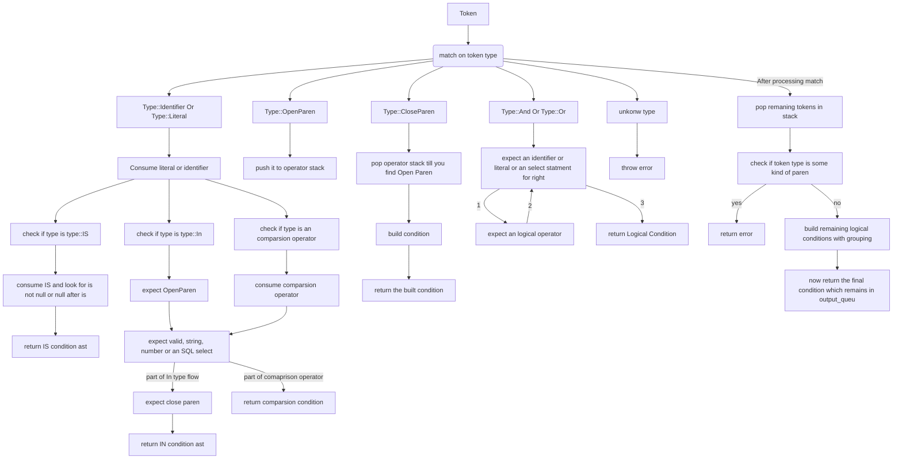

# Where clause parsing with shunting yard

```mermaid
flowchart TD
    A["Token"] --> B("match on token type")
    B --> n1["Type::Identifier Or Type::Literal"] & n2["Type::OpenParen"] & n3["Type::CloseParen"] & n4["Type::And Or Type::Or"] & n24["unkonw type"]
    B -- After processing match --> n26["pop remaning tokens in stack"]
    n1 --> n5["Consume literal or identifier"]
    n5 --> n6["check if type is type::IS"] & n7["check if type is type::In"] & n14["check if type is an comparsion operator"]
    n6 --> n8["consume IS and look for is not null or null after is"]
    n8 --> n9["return IS condition ast"]
    n7 --> n10["expect OpenParen"]
    n10 --> n11["expect valid, string, number or an SQL select"]
    n11 -- part of In type flow --> n12["expect close paren"]
    n12 --> n13["return IN condition ast"]
    n14 --> n15["consume comparsion operator"]
    n15 --> n11
    n11 -- part of comaprison operator --> n16["return comparsion condition"]
    n2 --> n17["push it to operator stack"]
    n3 --> n18["pop operator stack till you find Open Paren"]
    n18 --> n19["build condition"]
    n19 --> n20["return the built condition"]
    n4 --> n21["expect an identifier or literal or an select statment for right"]
    n21 -- 1 --> n22["expect an logical operator"]
    n22 -- 2 --> n21
    n21 -- 3 --> n23["return Logical Condition"]
    n24 --> n25["throw error"]
    n26 --> n27["check if token type is some kind of paren"]
    n27 -- yes --> n28["return error"]
    n27 -- no --> n29["build remaining logical conditions with grouping"]
    n29 --> n30["now return the final condition which remains in output_queu"]
```
